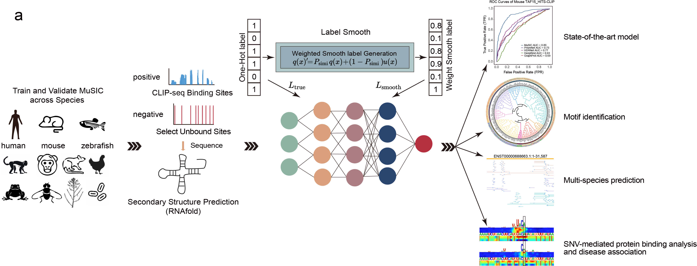

# 🧬 MuSIC

[](LICENSE)
[](https://www.python.org/)

A **PyTorch-based deep learning framework** for:

## 🧬 Augmented Prediction of Multi-Species RBP–RNA Interactions by Leveraging Evolutionary Conservation
**Authors:** Jiale He*, Tong Zhou*, Lufeng Hu*, Yuhua Jiao, Junhao Wang, Shengwen Yan, Siyao Jia, Qiuzhen Chen, Yangming Wang, Yucheng T. Yang, Lei Sun  
*Equal contribution

---

## 🗂️ Table of Contents
1. [📖 Project Overview](#project-overview)
2. [⚙️ Getting Started](#getting-started)
3. [📦 Datasets](#datasets)
4. [🚀 Usage](#usage)
5. [📁 Output Structure](#output-structure)
6. [🔬 SNV Impact Prediction](#SNV-impact-prediction)
7. [📝 Citation](#citation)
8. [📜 License](#copyright-and-license)
9. [📬 Contact](#contact)

---

## 📖 Project Overview
MuSIC is a deep learning toolkit for predicting RNA-binding protein (RBP) interactions with RNA across multiple species, leveraging both sequence and secondary structure information, and evolutionary conservation. It supports within-species and cross-species prediction, high-attention region analysis, saliency visualization, and SNV impact assessment.

---

### 🧩 MuSIC Framework



## ⚙️ Getting Started

### 1. Environment Setup
- **Recommended:**
    ```bash
    conda create -n MuSIC python=3.6
    conda activate MuSIC
    pip install -r requirements.txt
    pip install -e .
    ```
- **CUDA:**
    - GPU acceleration is recommended. Ensure CUDA 11.3 and compatible PyTorch are installed.

### 2. RNAfold Installation
- ViennaRNA is included in the `ViennaRNA` folder.
- If issues occur, see [ViennaRNA installation guide](https://www.tbi.univie.ac.at/RNA/ViennaRNA/doc/html/install.html).

### 3. Requirements
- Python 3.6.15
- PyTorch 1.10.2 (CUDA recommended)
- See `requirements.txt` for all dependencies.

---

## 📦 Datasets

### Directory Structure
```
data/
├── within_species_test/      # Within-species test sets
├── cross_species_test/       # Cross-species test sets
├── predict_data/             # Example FASTA files for prediction
├── within_species.tgz/       # 38 Within-species training data
├── cross_species.tgz/        # 38 Cross-species training data
├── 186rbp_dataset.tgz/       # 186 RBP datasets (per RBP folder)

```
### Get all MuSIC Datasets
```bash
cd MuSIC/data
# extract datasets (replace with actual URLs)
tar zxvf cross_species.tgz
tar zxvf within_species.tgz
tar zxvf 186rbp_dataset.tgz

### Data Format
- **FASTA**: Input RNA sequences.
- **H5**: Preprocessed data for model input.
- **TSV**: Annotation files for data sets.
- **List**: RBP and RBP conservation list files (e.g., `186rbp.list`)

```

### Data Preprocessing
Convert FASTA to H5 (with structure prediction):
```bash
python main.py --gerenate_h5 --infer_fasta_path data/predict_data/mouse_test.fa
```
- Output: `mouse_test.h5` in the same directory.

---

## 🚀 Usage

### Training & Validation
#### Within-Species
```bash
python main.py --train --rbp_name LIN28A_HITS-CLIP_Human --file_path data/within_species_test/ --gpuid 0
python main.py --validate --rbp_name LIN28A_HITS-CLIP_Human --file_path data/within_species_test/ --gpuid 0
```
#### Cross-Species
```bash
python main.py --train --rbp_name LIN28A_HITS-CLIP_Human --file_path data/cross_species_test/ --gpuid 0 --cross --species_name mouse --smooth_rate 0.85
python main.py --validate --rbp_name LIN28A_HITS-CLIP_Human --file_path data/cross_species_test/ --gpuid 0 --cross --species_name mouse --smooth_rate 0.85
```
- `--train`: train model
- `--validate`: validate model
- `--rbp_name`: RBP/data folder name
- `--file_path`: Data directory
- `--gpuid`: GPU device ID
- `--cross`: Enable cross-species mode
- `--species_name`: Target species
- `--smooth_rate`: RBP Conservation score Cross Species (0-1)

#### Hyperparameters (main.py)
- `--batch_size`, `--num_epochs`, `--weight_decay`, `--pos_weight`, `--learn_rate`, `--early_stopping`, `--exp_name`, `--out_dir`

### Inference (Prediction)
```bash
python main.py --infer --rbp_name LIN28A_HITS-CLIP_Human --infer_fasta_path data/predict_data/human_test.fa --gpuid 0
python main.py --infer --rbp_name LIN28A_HITS-CLIP_Human --infer_fasta_path data/predict_data/mouse_test.fa --gpuid 0 --cross --species_name mouse --smooth_rate 0.85
```
- Output: `.inference` files in `music/out/infer/`

### Compute High Attention Regions (HAR)
```bash
python main.py --har --rbp_name ... --infer_fasta_path ... --gpuid 0 [...other options]
```
- Output: HAR files in `music/out/har/`

### Plot Saliency Maps
```bash
python main.py --saliency_img --rbp_name ... --infer_fasta_path ... --gpuid 0 [...other options]
```
- Output: Images in `music/out/saliency_imgs/`

### Motif Resource
- Predicted RNA binding motifs for **186 RBPs across 11 species**: [Download here](tmp)

---

## 📁 Output Structure

- `music/out/model/`: Trained model weights (`.pth`)
- `music/out/logs/`: Training/validation logs (`.txt`)
- `music/out/infer/`: Inference results (`.inference`)
- `music/out/har/`: Inference results (`.har`)
- `music/out/saliency_imgs/`: Saliency map images (`.pdf`)
- `music/out/evals/`: Evaluation metrics (`.metrics`, `.probs`)

---

## 🔬 SNV Impact Prediction
MuSIC can predict the effects of **single nucleotide variants (SNVs)** on RBP binding sites.

### Example Workflow
1. **Train cross-species RBP model:**
    ```bash
    python main.py --train --rbp_name TARDBP_HUMAN --file_path data/186rbp_dataset --gpuid 0 --cross --species_name mouse --smooth_rate 0.64
    ```
2. **Predict on variant and wild-type:**
    ```bash
    python main.py --infer --rbp_name TARDBP_HUMAN --infer_fasta_path mouse_variants.fa --gpuid 0 --cross --species_name mouse --smooth_rate 0.64
    python main.py --infer --rbp_name TARDBP_HUMAN --infer_fasta_path mouse_wt.fa --gpuid 0 --cross --species_name mouse --smooth_rate 0.64
    ```
3. **Merge and analyze results:**
    ```bash
    python SNV_impact_prediction/merge_snv_impact.py --variants TARDBP_cross_mouse_music_mouse_variants.inference --wt TARDBP_cross_mouse_music_mouse_wt.inference --output SNV_impact_prediction
    ```
- Output: SNV impact scores in `SNV_impact_prediction/`
### For example: SNV Effect for RBP-RNA interaction 

---

## 📝 Citation
If you use MuSIC in your research, please cite:
```bibtex
@article{He2025cr,
  title={Augmented Prediction of Multi-Species RBP–RNA Interactions by Leveraging Evolutionary Conservation},
  author={Sun, Lei and Xu, Kui and Huang, Wenze and Yang, Yucheng T. and Li, Pan and Tang, Lei and Xiong, Tuanlin and Zhang, Qiangfeng Cliff},
  year={2021},
  doi={10.1038/s41422-021-00476-y},
  journal={Cell Research}
}
```

---

## 📜 Copyright and License
This project is free for non-commercial use. For details, please refer to the [LICENSE](LICENSE) file.

---

## 📬 Contact
For questions, bug reports, or contributions, please contact the authors or open an issue on GitHub.
