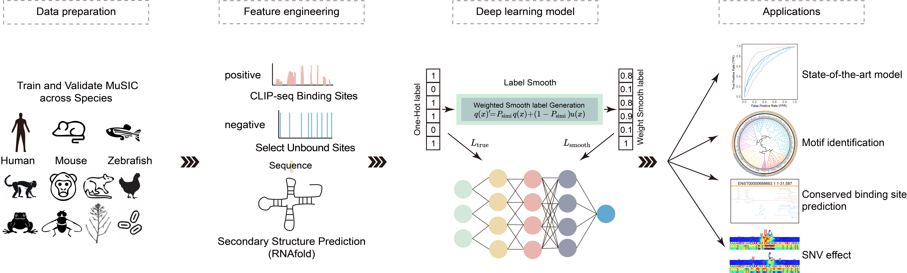
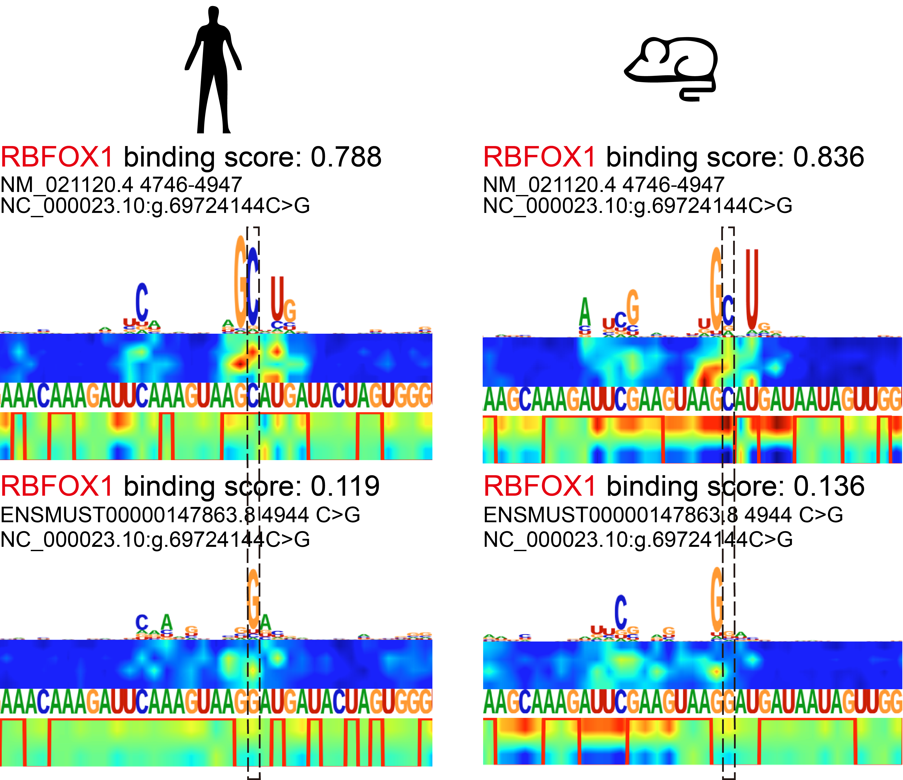

# 🧬 MuSIC

[](LICENSE)
[](https://www.python.org/)

A **PyTorch-based deep learning framework**

---

## 🧩 Project Overview

MuSIC is a deep learning toolkit for predicting RNA-binding protein (RBP) interactions with RNA across multiple species, leveraging both sequence and secondary structure information, and evolutionary conservation. It supports within-species and cross-species prediction, high-attention region analysis, saliency visualization, analysis fo binding Site conservation and SNV impact assessment.

**Authors:**  
Jiale He*, Tong Zhou*, Lufeng Hu*, Yuhua Jiao, Junhao Wang, Shengwen Yan, Siyao Jia, Qiuzhen Chen, Yangming Wang, Yucheng T. Yang, Lei Sun  

*Equal contribution

---

### 🧩 MuSIC Framework


- [⚙️ Getting Started](#getting-started)
- [📦 Datasets](#datasets)
- [🚀 Usage](#usage)
- [📁 Output Directory Structure](#output-directory-structure)
- [🧬 Binding Site Conservation](#binding-site-conservation)
- [🧬 SNV Impact Prediction](#snv-impact-prediction)
- [📖 Citation](#citation)
- [📜 License](#license)
- [📬 Contact](#contact)
---

## ⚙️Getting Started

### 1. Environment Setup

```bash
conda create -n MuSIC python=3.6
conda activate MuSIC
pip install -r requirements.txt
pip install -e .
```
- **CUDA:**  
  GPU acceleration is recommended. Ensure CUDA 11.3 and compatible PyTorch are installed.

### 2. RNAfold Installation

See the [ViennaRNA installation guide](https://www.tbi.univie.ac.at/RNA/ViennaRNA/doc/html/install.html).

### 3. Requirements

- Python 3.6.15
- PyTorch 1.10.2 (CUDA recommended)
- See `requirements.txt` for all dependencies.

---

## 📦Datasets 

### Directory Structure

```text
data/
├── within_species_test/      # Within-species test sets
├── cross_species_test/       # Cross-species test sets
├── predict_data/             # Example FASTA files for prediction
├── 186rbp_dataset/           # Human data for training
```
### Data Format

- **FASTA**: Input RNA sequences
- **H5**: Preprocessed data for model input
- **TSV**: Annotation files for datasets
- **List**: RBP and RBP conservation list files (e.g., `186rbp.list`)

### Data Preprocessing

Convert FASTA to H5 (with structure prediction):

```bash
python main.py \
  --gerenate_h5 \
  --infer_fasta_path data/predict_data/mouse_test.fa
```
- Output: `mouse_test.h5` in the same directory.

---

## 🚀Usage

### Within-Species Training & Validation

```bash
python main.py \
    --train \
    --rbp_name LIN28A_HITS-CLIP_Human \
    --file_path data/within_species_test/ \
    --gpuid 0
```

```bash
python main.py \
    --validate \
    --rbp_name LIN28A_HITS-CLIP_Human \
    --file_path data/within_species_test/ \
    --gpuid 0
```

**Arguments:**
- `--train`: Initiate model training
- `--validate`: Perform model validation
- `--rbp_name`: Name of the RBP or corresponding data folder
- `--file_path`: Path to the dataset directory
- `--gpuid`: GPU device identifier

---

### Cross-Species Training & Validation

```bash
python main.py \
    --train \
    --rbp_name LIN28A_HITS-CLIP_Human \
    --file_path data/cross_species_test/ \
    --gpuid 0 \
    --cross \
    --species_name mouse \
    --smooth_rate 0.85
```

```bash
python main.py \
    --validate \
    --rbp_name LIN28A_HITS-CLIP_Human \
    --file_path data/cross_species_test/ \
    --gpuid 0 \
    --cross \
    --species_name mouse \
    --smooth_rate 0.85
```

**Additional Arguments:**
- `--cross`: Enable cross-species mode
- `--species_name`: Target species
- `--smooth_rate`: RBP conservation score for cross-species (0–1)

---

### Inference (Prediction)

```bash
python main.py \
    --infer \
    --rbp_name LIN28A_HITS-CLIP_Human \
    --infer_fasta_path data/predict_data/human_test.fa \
    --gpuid 0
```

```bash
python main.py \
    --infer \
    --rbp_name LIN28A_HITS-CLIP_Human \
    --infer_fasta_path data/predict_data/mouse_test.fa \
    --gpuid 0 \
    --cross \
    --species_name mouse \
    --smooth_rate 0.85
```

**Output:**  
Inference results are saved as `.inference` files in `music/out/infer/`.

---

### High Attention Region (HAR) Computation

```bash
python main.py \
    --har \
    --rbp_name LIN28A_HITS-CLIP_Human \
    --infer_fasta_path data/predict_data/human_test.fa \
    --gpuid 0
```

```bash
python main.py \
    --har \
    --rbp_name LIN28A_HITS-CLIP_Human \
    --infer_fasta_path data/predict_data/mouse_test.fa \
    --gpuid 0 \
    --cross \
    --species_name mouse \
    --smooth_rate 0.85
```

**Output:**  
HAR results are stored in `music/out/har/`.

---

### Saliency Map Visualization

```bash
python main.py \
    --saliency_img \
    --rbp_name LIN28A_HITS-CLIP_Human \
    --infer_fasta_path data/predict_data/human_test.fa \
    --gpuid 0
```

```bash
python main.py \
    --saliency_img \
    --rbp_name LIN28A_HITS-CLIP_Human \
    --infer_fasta_path data/predict_data/mouse_test.fa \
    --gpuid 0 \
    --cross \
    --species_name mouse \
    --smooth_rate 0.85
```

**Output:**  
Saliency map images are generated in `music/out/saliency_imgs/`.

---

### Motif Resource

Predicted RNA binding motifs for 186 RBPs across 11 species are available for download:

- **PDF:** [MuSIC 11 Species Motif Collection (PDF)](https://github.com/GALE1228/MuSIC_11species_motif_pdf)
- **PNG:** [MuSIC 11 Species Motif Collection (PNG)](https://github.com/GALE1228/MuSIC_11species_motif_fig)

---

## 📁Output Directory Structure

- `music/out/model/`: Trained model weights (`.pth`)
- `music/out/logs/`: Training and validation logs (`.txt`)
- `music/out/infer/`: Inference results (`.inference`)
- `music/out/har/`: High Attention Region results (`.har`)
- `music/out/saliency_imgs/`: Saliency map images (`.pdf`)
- `music/out/evals/`: Evaluation metrics (`.metrics`, `.probs`)

---

## 🧬Binding Site Conservation

The workflow for analyzing cross-species RBP binding site conservation is summarized as follows:

- **Homologous Transcript Screening:**  
  Use `mashmap.sh` for rapid cross-species transcript alignment, followed by `uniq.sh` to remove duplicates and count conserved transcript pairs.

- **Binding Site Filtering:**  
  Filter cross-species RBP binding sites using `grep.sh` and `filter.sh`, then merge and process BED files.

- **Homologous Sequence Alignment:**  
  Extract and align homologous RNA sequences for further analysis.

- **Statistical Analysis:**  
  Perform statistical analysis and visualization of binding site conservation using scripts such as `count.sh`, `count_box.sh`, `count_heatmap.sh`, and R scripts for plotting.

- **RBP Family and Species Conservation:**  
  Analyze conservation at the RBP family and species level with dedicated scripts and plotting tools.

**Example usage:**
```bash
# Cross-species transcript alignment
bash script/mashmap.sh

# Filter and process binding sites
bash script/grep.sh
bash script/filter.sh

# Statistical analysis and visualization
bash script/count.sh
Rscript script/plot_side.R -H count/count_heatmap.txt -B count/count_box.txt -c 2 -o figs/count_side_v2.pdf
```

For a detailed workflow and advanced options, please refer to [binding_site_conservation/Fig5_workflow.md](binding_site_conservation/Fig5_workflow.md).

---

## 🧬SNV Impact Prediction

MuSIC is capable of predicting the effects of single nucleotide variants (SNVs) on RBP binding sites.

**Example Workflow:**

1. **Train a cross-species RBP model:**
    ```bash
    python main.py \
        --train \
        --rbp_name TARDBP_HUMAN \
        --file_path data/186rbp_dataset \
        --gpuid 0 \
        --cross \
        --species_name mouse \
        --smooth_rate 0.64
    ```

2. **Predict on variant and wild-type sequences:**
    ```bash
    python main.py \
        --infer \
        --rbp_name TARDBP_HUMAN \
        --infer_fasta_path mouse_variants.fa \
        --gpuid 0 \
        --cross \
        --species_name mouse \
        --smooth_rate 0.64

    python main.py \
        --infer \
        --rbp_name TARDBP_HUMAN \
        --infer_fasta_path mouse_wt.fa \
        --gpuid 0 \
        --cross \
        --species_name mouse \
        --smooth_rate 0.64
    ```

3. **Merge and analyze results:**
    ```bash
    python SNV_impact_prediction/merge_snv_impact.py \
        --variants TARDBP_cross_mouse_music_mouse_variants.inference \
        --wt TARDBP_cross_mouse_music_mouse_wt.inference \
        --output SNV_impact_prediction
    ```
- Output: SNV impact scores in `SNV_impact_prediction/`

**Example:**  
SNV Effect for RBP-RNA interaction  


---

## 📖Citation

If you use MuSIC in your research, please cite:

```bibtex
@article{xxx,
  title={xxx},
  author={xxx},
  year={xxx},
  doi={xxx},
  journal={xxx}
}
```

---

## 📜License

This project is covered under the MIT License.


---

## 📬Contact

Thank you for using MuSIC! For questions, bug reports, or contributions, please contact the authors or open an issue on GitHub.

---
